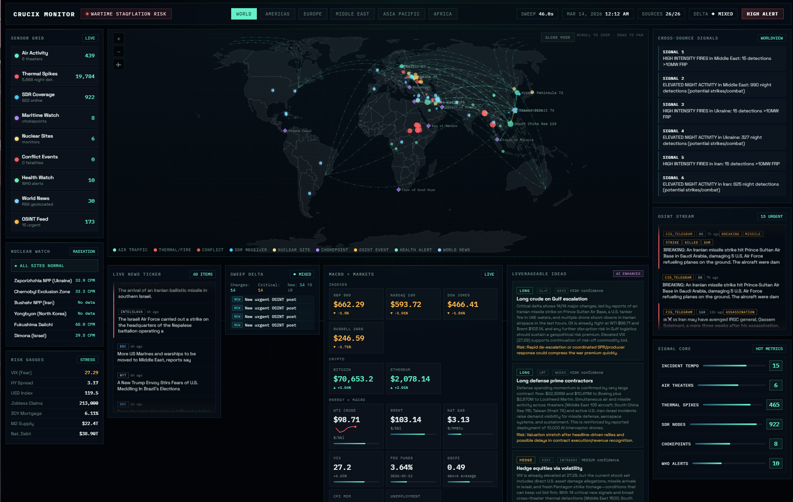
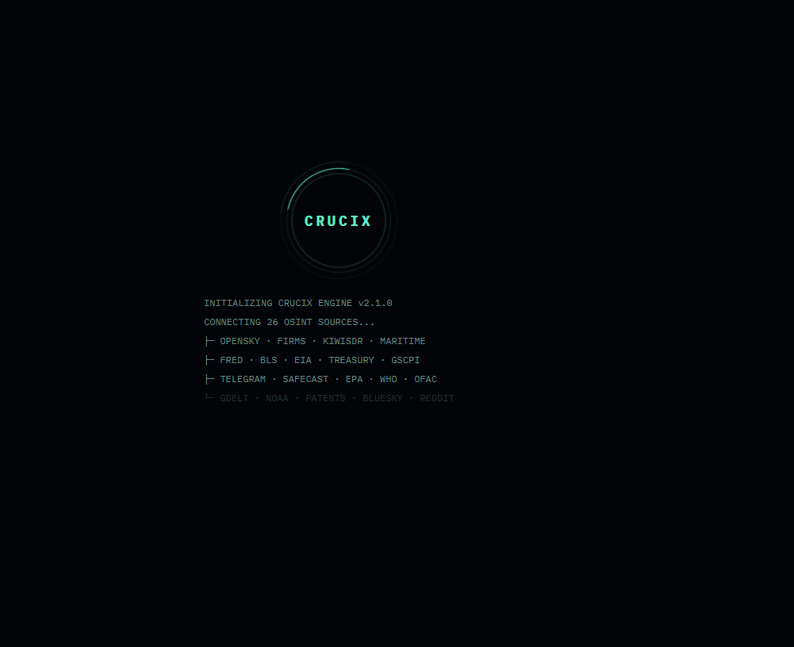
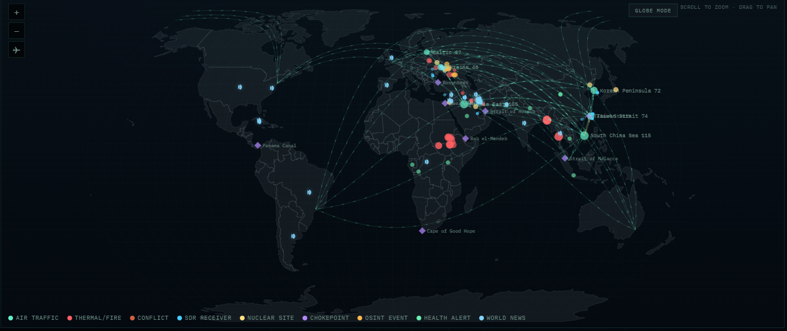
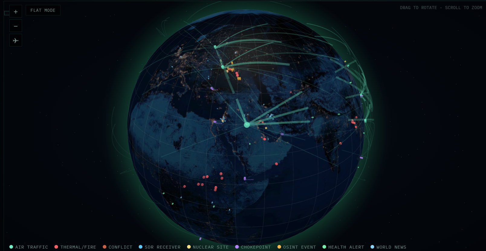

<div align="center">

# VIGIL

**Your own intelligence terminal. 30 sources. One command. Zero cloud.**

[](#quick-start)
[](LICENSE)
[-orange)](#architecture)
[](#data-sources)
[](#docker)



<details>
<summary>More screenshots</summary>

| Boot Sequence | World Map |
|:---:|:---:|
|  |  |

| 3D Globe View |
|:---:|
|  |

</details>

</div>

WORLD-MONITOR pulls satellite fire detection, flight tracking, radiation monitoring, satellite constellation tracking, economic indicators, live market prices, conflict data, sanctions lists, Bangladesh district weather, and social sentiment from 30 open-source intelligence feeds — in parallel, every 15 minutes — and renders everything on a single self-contained Jarvis-style dashboard.

Hook it up to an LLM and it becomes a **two-way intelligence assistant** — pushing multi-tier alerts to Telegram and Discord when something meaningful changes, responding to commands like `/brief` and `/sweep` from your phone, and generating actionable trade ideas grounded in real cross-domain data.

No cloud. No telemetry. No subscriptions. Just `node server.mjs` and you're running.

---

## Quick Start

```bash
# 1. Clone the repo
git clone https://github.com/Shalha-Mucha18/WORLD-MONITOR.git
cd WORLD-MONITOR

# 2. Install dependencies (just Express)
npm install

# 3. Copy env template and add your API keys (see below)
cp .env.example .env

# 4. Start the dashboard
npm run dev
```

> **If `npm run dev` fails silently**, run Node directly instead:
> ```bash
> node --trace-warnings server.mjs
> ```
> You can also run `node diag.mjs` to diagnose the exact issue.

The dashboard opens automatically at `http://localhost:3117`. The first sweep takes 30–60 seconds — the dashboard will appear empty until it completes. After that, it auto-refreshes every 15 minutes via SSE.

**Requirements:** Node.js 22+ (uses native `fetch`, top-level `await`, ESM)

### Docker

```bash
git clone https://github.com/Shalha-Mucha18/WORLD-MONITOR.git
cd WORLD-MONITOR
cp .env.example .env
docker compose up -d
```

Dashboard at `http://localhost:3117`. Sweep data persists in `./runs/` via volume mount.

---

## What You Get

### Live Dashboard
A self-contained Jarvis-style HUD with:
- **3D WebGL globe** (Globe.gl) with atmosphere glow, star field, and smooth rotation — plus a classic flat map toggle
- **9 marker types** across both views: fire detections, air traffic, radiation sites, maritime chokepoints, SDR receivers, OSINT events, health alerts, geolocated news, conflict events
- **Bangladesh district weather** — live temperature bar chart for all 64 districts with condition color-coding
- **Animated 3D flight corridor arcs** between air traffic hotspots and global hubs
- **Region filters** (World, Americas, Europe, Middle East, Asia Pacific, Africa)
- **Live market data** — indexes, crypto, energy, commodities via Yahoo Finance (no API key needed)
- **Risk gauges** — VIX, high-yield spread, supply chain pressure index
- **OSINT feed** — English-language posts from 17 Telegram intelligence channels
- **News ticker** — merged RSS + GDELT headlines + Telegram posts, auto-scrolling
- **Sweep delta** — live panel showing what changed since last sweep
- **Cross-source signals** — correlated intelligence across satellite, economic, conflict, and social domains
- **Nuclear watch** — real-time radiation readings from Safecast + EPA RadNet
- **Space watch** — CelesTrak satellite tracking: recent launches, ISS, military constellations
- **Leverageable ideas** — AI-generated trade ideas (with LLM) or signal-correlated ideas (without)

### Auto-Refresh
The server runs a sweep cycle every 15 minutes (configurable). Each cycle:
1. Queries all 30 sources in parallel (~30s)
2. Synthesizes raw data into dashboard format
3. Computes delta from previous run — visible in the **Sweep Delta** panel
4. Generates LLM trade ideas (if configured)
5. Evaluates breaking news alerts — multi-tier (FLASH / PRIORITY / ROUTINE) with semantic dedup
6. Pushes update to all connected browsers via SSE

### Telegram Bot (Two-Way)

| Command | What It Does |
|---------|-------------|
| `/status` | System health, last sweep time, source status |
| `/sweep` | Trigger a manual sweep cycle |
| `/brief` | Compact text summary of the latest intelligence |
| `/mute` / `/unmute` | Silence or resume alerts |
| `/help` | Show all available commands |

### Discord Bot (Two-Way)

| Command | What It Does |
|---------|-------------|
| `/status` | System health, last sweep time, source status |
| `/sweep` | Trigger a manual sweep cycle |
| `/brief` | Compact text summary of the latest intelligence |

Alerts are delivered as rich embeds: red for FLASH, yellow for PRIORITY, blue for ROUTINE.

**Webhook fallback:** Set `DISCORD_WEBHOOK_URL` for one-way alerts with no bot required.

### Optional LLM Layer
- **AI trade ideas** — 5-8 actionable ideas citing specific data
- **Smarter alert evaluation** — classifies signals into FLASH/PRIORITY/ROUTINE tiers
- Providers: `anthropic`, `openai`, `gemini`, `openrouter`, `codex`, `minimax`, `mistral`
- Graceful fallback — rule-based engine takes over when LLM is unavailable

---

## API Keys Setup

```bash
cp .env.example .env
```

### Required for Best Results (all free)

| Key | Source | How to Get |
|-----|--------|------------|
| `FRED_API_KEY` | Federal Reserve Economic Data | [fred.stlouisfed.org](https://fred.stlouisfed.org/docs/api/api_key.html) |
| `FIRMS_MAP_KEY` | NASA FIRMS (satellite fire data) | [firms.modaps.eosdis.nasa.gov](https://firms.modaps.eosdis.nasa.gov/api/area/) |
| `EIA_API_KEY` | US Energy Information Administration | [api.eia.gov](https://www.eia.gov/opendata/register.php) |

### Optional (enable additional sources)

| Key | Source |
|-----|--------|
| `ACLED_EMAIL` + `ACLED_PASSWORD` | Armed conflict event data |
| `AISSTREAM_API_KEY` | Maritime AIS vessel tracking |
| `CLOUDFLARE_API_TOKEN` | Internet outage detection |

### LLM Provider (optional)

Set `LLM_PROVIDER` to one of: `anthropic`, `openai`, `gemini`, `codex`, `openrouter`, `minimax`, `mistral`

| Provider | Key Required |
|----------|-------------|
| `anthropic` | `LLM_API_KEY` |
| `openai` | `LLM_API_KEY` |
| `gemini` | `LLM_API_KEY` |
| `openrouter` | `LLM_API_KEY` |
| `codex` | None (`~/.codex/auth.json`) |
| `minimax` | `LLM_API_KEY` |
| `mistral` | `LLM_API_KEY` |

### Telegram & Discord

| Key | Purpose |
|-----|---------|
| `TELEGRAM_BOT_TOKEN` | Telegram alerts + bot commands |
| `TELEGRAM_CHAT_ID` | Your Telegram chat ID |
| `DISCORD_BOT_TOKEN` | Discord bot |
| `DISCORD_CHANNEL_ID` | Discord alert channel |
| `DISCORD_WEBHOOK_URL` | Webhook-only fallback (no bot) |

### Without Any Keys

WORLD-MONITOR works with zero API keys. 18+ sources require no authentication. Sources that need keys return structured errors and the sweep continues normally.

---

## Architecture

```
world-monitor/
├── server.mjs                 # Express server (SSE, auto-refresh, bot commands)
├── crucix.config.mjs          # Configuration + delta thresholds
├── diag.mjs                   # Diagnostic script
├── .env.example               # All documented env vars
│
├── apis/
│   ├── briefing.mjs           # Master orchestrator — 30 sources in parallel
│   ├── utils/
│   │   ├── fetch.mjs          # safeFetch() — timeout, retries, abort
│   │   └── env.mjs            # .env loader
│   └── sources/               # 30 self-contained source modules
│       └── ...                # Each exports briefing() → structured data
│
├── dashboard/
│   ├── inject.mjs             # Data synthesis + HTML injection
│   └── public/
│       └── jarvis.html        # Self-contained dashboard HUD
│
└── lib/
    ├── llm/                   # LLM abstraction (8 providers, raw fetch)
    ├── delta/                 # Change tracking between sweeps
    └── alerts/                # Telegram + Discord bots
```

### Design Principles
- **Pure ESM** — every file is `.mjs` with explicit imports
- **Minimal dependencies** — Express is the only runtime dependency
- **Parallel execution** — `Promise.allSettled()` fires all 30 sources simultaneously
- **Graceful degradation** — missing keys produce errors, not crashes
- **Each source is standalone** — run `node apis/sources/noaa.mjs` to test any source independently
- **Self-contained dashboard** — the HTML file works with or without the server

---

## Data Sources (30)

### Tier 1: Core OSINT & Geopolitical (11)

| Source | What It Tracks | Auth |
|--------|---------------|------|
| **GDELT** | Global news events, conflict mapping | None |
| **OpenSky** | Real-time ADS-B flight tracking | None |
| **NASA FIRMS** | Satellite fire/thermal anomaly detection | Free key |
| **Maritime/AIS** | Vessel tracking, dark ships | Free key |
| **Safecast** | Radiation monitoring near nuclear sites | None |
| **ACLED** | Armed conflict events | Free (OAuth2) |
| **ReliefWeb** | UN humanitarian crisis tracking | None |
| **WHO** | Disease outbreaks and health emergencies | None |
| **OFAC** | US Treasury sanctions list | None |
| **OpenSanctions** | Global sanctions (30+ sources) | Partial |
| **ADS-B Exchange** | Unfiltered flight tracking including military | Paid |

### Tier 2: Economic & Financial (7)

| Source | What It Tracks | Auth |
|--------|---------------|------|
| **FRED** | 22 key indicators: yield curve, CPI, VIX | Free key |
| **US Treasury** | National debt, yields, fiscal data | None |
| **BLS** | CPI, unemployment, nonfarm payrolls | None |
| **EIA** | WTI/Brent crude, natural gas, inventories | Free key |
| **GSCPI** | NY Fed Global Supply Chain Pressure Index | None |
| **USAspending** | Federal spending and defense contracts | None |
| **UN Comtrade** | Strategic commodity trade flows | None |

### Tier 3: Weather, Environment, Tech, Social (8)

| Source | What It Tracks | Auth |
|--------|---------------|------|
| **NOAA/NWS** | Active US severe weather alerts | None |
| **Bangladesh Weather** | Live conditions for all 64 BD districts | None |
| **EPA RadNet** | US government radiation monitoring | None |
| **USPTO Patents** | Patent filings in strategic tech areas | None |
| **Bluesky** | Social sentiment on geopolitical topics | None |
| **Reddit** | Social sentiment from key subreddits | OAuth |
| **Telegram** | 17 curated OSINT/conflict/finance channels | None |
| **KiwiSDR** | Global HF radio receiver network | None |

### Tier 4: Space & Satellites (1)

| Source | What It Tracks | Auth |
|--------|---------------|------|
| **CelesTrak** | Satellite launches, ISS, military constellations | None |

### Tier 5: Live Market Data (1)

| Source | What It Tracks | Auth |
|--------|---------------|------|
| **Yahoo Finance** | Real-time prices: SPY, QQQ, BTC, Gold, WTI, VIX | None |

### Tier 6: Cyber & Infrastructure (2)

| Source | What It Tracks | Auth |
|--------|---------------|------|
| **CISA KEV** | Known exploited vulnerabilities catalog | None |
| **Cloudflare Radar** | Internet outages and traffic anomalies | Free key |

---

## npm Scripts

| Script | Description |
|--------|-------------|
| `npm run dev` | Start dashboard with auto-refresh |
| `npm run sweep` | Run a single sweep, output JSON to stdout |
| `npm run inject` | Inject latest data into static HTML |
| `npm run brief:save` | Run sweep + save timestamped JSON |
| `npm run clean` | Delete runtime state (runs/, memory/) |
| `npm run diag` | Run diagnostics |

---

## Configuration

| Variable | Default | Description |
|----------|---------|-------------|
| `PORT` | `3117` | Dashboard server port |
| `REFRESH_INTERVAL_MINUTES` | `15` | Auto-refresh interval |
| `LLM_PROVIDER` | disabled | LLM provider selection |
| `LLM_API_KEY` | — | API key for LLM |
| `TELEGRAM_BOT_TOKEN` | disabled | Telegram alerts + commands |
| `TELEGRAM_CHAT_ID` | — | Your Telegram chat ID |
| `DISCORD_BOT_TOKEN` | disabled | Discord alerts + commands |
| `DISCORD_CHANNEL_ID` | — | Discord alert channel |
| `DISCORD_WEBHOOK_URL` | — | Webhook fallback (no bot) |

Delta thresholds are configurable in `crucix.config.mjs` under `delta.thresholds`.

---

## API Endpoints

| Endpoint | Description |
|----------|-------------|
| `GET /` | Jarvis HUD dashboard |
| `GET /api/data` | Current synthesized intelligence (JSON) |
| `GET /api/health` | Server status, uptime, source count |
| `GET /events` | SSE stream for live push updates |

---

## Contributing

Found a bug? Want to add a new source? PRs welcome. Each source is a standalone module in `apis/sources/` — export a `briefing()` function that returns structured data and add it to `apis/briefing.mjs`.

---

## License

AGPL-3.0
